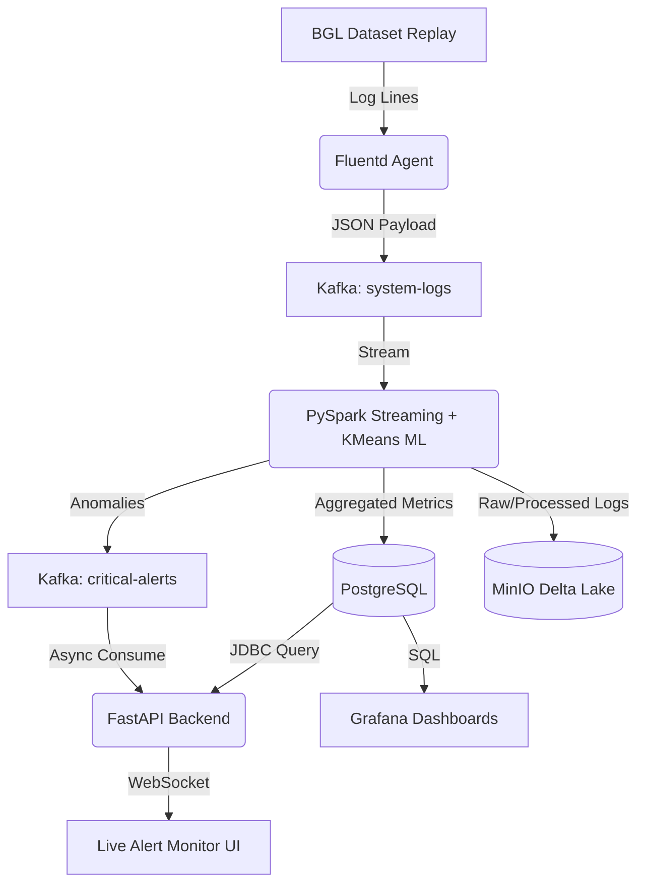

# AIOps Distributed Log Diagnostics Platform


An enterprise-grade, highly available AIOps platform that ingests, processes, and analyzes high-throughput distributed supercomputer logs in real-time. Built around a robust Lambda architecture, the system leverages unsupervised Machine Learning (K-Means) to detect anomalies, routing them via WebSockets for live monitoring while persisting telemetry into a Delta Lake and PostgreSQL for historical analytics.

## 🏗️ Architecture



## ✨ Features

* **High-Throughput Ingestion**: Fluentd agents processing BGL supercomputer logs into a 3-node Kafka KRaft cluster.
* **Real-time Machine Learning**: PySpark streaming job utilizing an NLP pipeline (Tokenizer → HashingTF → IDF) and K-Means clustering to detect anomalies on the fly.
* **Modern Lakehouse Storage**: S3-compatible MinIO object storage backing an ACID-compliant Delta Lake.
* **Live WebSocket Alerting**: FastAPI backend bridging Kafka to a React/HTML live monitor for instant anomaly notifications.
* **Comprehensive Observability**: Pre-provisioned Grafana dashboards tracking component health, error rates, and anomaly trends.
* **Chaos Engineering Suite**: Built-in orchestration to inject node failures (Fluentd crashes, Kafka controller deaths, Spark Master SIGKILLs) to validate zero-data-loss recovery.

## 🛠️ Prerequisites

Before you begin, ensure you have met the following requirements:
* **Docker & Docker Compose** (Ensure Docker Desktop is running if on Windows/Mac)
* **Python 3.12+** (For running external helper scripts and tests)
* **Minimum System Resources:** At least 8GB RAM allocated to Docker (12GB+ recommended).

## 🚀 Quick Start Guide

### 1. Clone & Setup Environment
```bash
git clone https://github.com/yourusername/aiops-platform.git
cd aiops-platform

# Create and activate a virtual environment
python -m venv .venv
# Windows:
.venv\Scripts\activate
# Linux/Mac:
source .venv/bin/activate

# Install Python requirements
pip install -r requirements.txt
```

### 2. Build and Launch Infrastructure
```bash
# Build custom images (Spark, Fluentd, FastAPI, Log Generator)
docker-compose build

# Start the entire stack in the background
docker-compose up -d
```

Wait roughly 30–60 seconds for the Kafka cluster to elect a controller and for all services to become healthy. You can verify health using:
```bash
python scripts/health_check.py --retries 10
```

### 3. Initialize Databases & Topics
```bash
# Apply PostgreSQL analytics schema
type docker\postgres\init.sql | docker exec -i postgres-db psql -U aiops_user -d aiops_analytics
# (On Linux/Mac use: cat docker/postgres/init.sql | ...)

# Ensure Kafka topics exist
python scripts/setup_kafka_topics.py

# Initialize Delta Lake tables on MinIO
docker cp scripts/init_lakehouse.py spark-master:/tmp/init_lakehouse.py
docker exec spark-master python3 /tmp/init_lakehouse.py
```

### 4. Start the Spark ML Streaming Job
This will begin tailing Kafka, analyzing logs for anomalies, writing to Delta Lake, and publishing alerts.
```bash
python scripts/submit_spark_job.py --job stream_processor
```

---

## 📊 Usage & Dashboards

Once the pipeline is running, data will immediately begin flowing through the system.

* **Live Anomaly Monitor (WebSocket):** [http://localhost:8000/demo](http://localhost:8000/demo)
* **Grafana Dashboards:** [http://localhost:3000](http://localhost:3000) *(Login: `admin` / `aiops_grafana`)*
* **MinIO Console:** [http://localhost:9001](http://localhost:9001) *(Login: `aiops_admin` / `aiops_secret_2024`)*
* **Spark Master UI:** [http://localhost:8081](http://localhost:8081)
* **FastAPI Swagger Docs:** [http://localhost:8000/docs](http://localhost:8000/docs)

---

## 💥 Chaos Engineering Suite

This project includes a comprehensive Phase 5 chaos engineering orchestrator to validate system resilience.

Run the entire chaos suite (Fluentd crashes, Kafka re-elections, Delta transaction safety, E2E Latency):
```bash
python chaos/chaos_runner.py
```

Or run individual scenarios:
```bash
python chaos/chaos_runner.py --scenario fluentd
python chaos/chaos_runner.py --scenario kafka
python chaos/chaos_runner.py --scenario delta
python chaos/chaos_runner.py --scenario latency
```

To run the isolated unit/logic tests:
```bash
pytest tests/test_chaos_phase5.py -v -k unit
```

---

## 🛑 Teardown

To stop the cluster while preserving data:
```bash
docker-compose stop
```

To completely obliterate the cluster and all stored data (fresh start):
```bash
docker-compose down -v
```

## 📝 License

Distributed under the MIT License. See `LICENSE` for more information.
